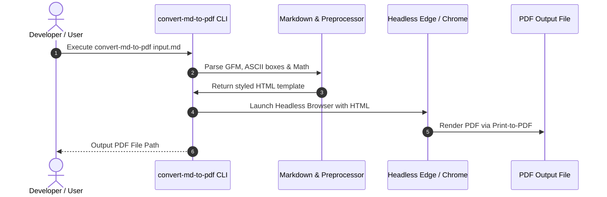

# Sample Document: Markdown to PDF Conversion

> **Author**: vannt-dev  
> **Tool**: `convert-md-to-pdf`  
> **Description**: Demonstration of technical report rendering with Mermaid diagrams, ASCII UI mockups, tables, and LaTeX math.

---

## 1. Overview & System Features

This document demonstrates the capabilities of **`convert-md-to-pdf`**, a CLI utility designed to produce beautiful, publication-ready PDF documents from Markdown files.

### Key Features Matrix

| Feature | Support | Engine / Details |
| :--- | :---: | :--- |
| **Mermaid Diagrams** | ✅ | Sequence, Flowchart, Class, Gantt |
| **LaTeX Math** | ✅ | Display Math & Inline Math |
| **ASCII UI Mockups** | ✅ | Monospaced High-Contrast Dark Box |
| **Multi-Language UTF-8** | ✅ | Full support for CJK (Japanese, Chinese) & Vietnamese |
| **Custom Themes** | ✅ | `modern`, `dark`, `academic`, `minimal` |

---

## 2. Technical Architecture & Sequence Workflow



---

## 3. UI Mockup Wireframe Example

```
┌────────────────────────────────────────────────────────────────────────────────────────┐
│ DASHBOARD UI MOCKUP: VISAS MANAGEMENT APPLICATION                                      │
├────────────────────────────────────────────────────────────────────────────────────────┤
│ [1.0] HEADER NAVIGATION                                                                │
│  • Home  • Applications  • Group Processing  • Documents  • Settings                  │
├────────────────────────────────────────────────────────────────────────────────────────┤
│ [2.0] BATCH ACTION CONTROLS                                                           │
│  • Button 1: [ Request Signatures ] (Active when dossier is ready)                     │
│  • Button 2: [ Export Online ZIP (CSV+PDF) ]                                           │
└────────────────────────────────────────────────────────────────────────────────────────┘
```

---

## 4. Mathematical Formula

$$\text{Estimated Date (No. 3.7.1.x)} = \text{Target Date} - \text{Offset Days}$$

---

## 5. Conclusion

The tool delivers pixel-perfect document rendering with zero manual styling overhead.
